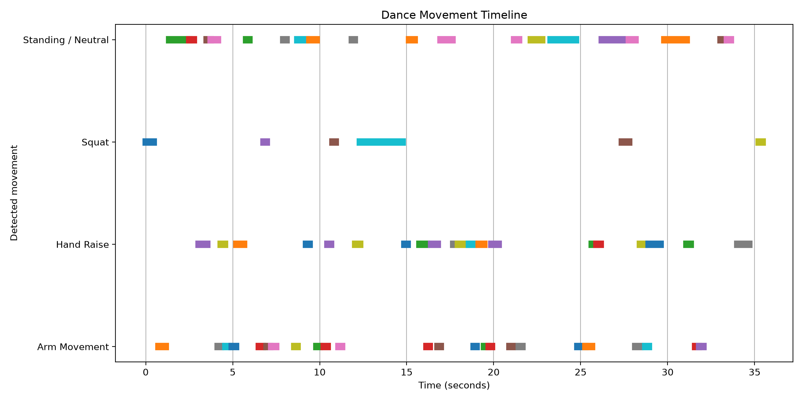

# Dance Motion Analysis Using Human Pose Estimation

## Overview

This project analyzes human movement in dance videos using pose estimation.

A dance practice video is processed using MediaPipe Pose to detect body landmarks frame by frame. The extracted landmark coordinates are then analyzed to visualize joint trajectories, movement intensity, and joint-angle changes over time.

## Pipeline

```text
Dance Video
    ↓
OpenCV Video Processing
    ↓
MediaPipe Pose Estimation
    ↓
33 Body Landmarks
    ↓
Landmark Coordinate CSV
    ↓
Motion Analysis
    ↓
Trajectory and Joint-Angle Visualization
```

## Features

* Human pose estimation using MediaPipe
* Frame-by-frame body landmark extraction
* Normalized joint coordinates
* Pose skeleton visualization
* Joint movement trajectories
* Movement intensity analysis
* Joint-angle analysis
* CSV export of extracted motion data

## Body Landmarks Analyzed

The project focuses on:

* Left and right wrists
* Left and right ankles
* Left and right shoulders
* Left and right hips
* Left elbow

## Technologies

* Python
* MediaPipe
* OpenCV
* NumPy
* Pandas
* Matplotlib

## Project Structure

```text
dance-motion-analysis/
│
├── input/
│   └── dance.mp4
│
├── output/
│   ├── annotated/
│   ├── data/
│   └── plots/
│
├── src/
│   ├── test_video.py
│   ├── pose_detection.py
│   ├── analyze_motion.py
│   ├── joint_angles.py
│   └── visualize.py
│
├── requirements.txt
└── README.md
```

## How It Works

For each frame of the input video, MediaPipe estimates the coordinates of body landmarks.

The coordinates are stored in a CSV file containing the frame number, landmark ID, normalized x/y/z coordinates, and landmark visibility.

Movement between consecutive frames is calculated using Euclidean distance:

```text
distance = sqrt((x2 - x1)^2 + (y2 - y1)^2)
```

The movement values of selected joints are then combined to estimate overall movement intensity throughout the dance.

Joint angles are calculated using vectors between connected body landmarks.

## Results

The project generates:

* Pose-annotated dance video
* Landmark coordinate dataset
* Wrist movement trajectories
* Ankle movement trajectories
* Overall movement-intensity graph
* Joint-angle graph

## Future Improvements

Possible extensions include:

* Dance movement classification
* Comparing two dancers
* Detecting repeated dance sequences
* Dance similarity scoring
* Movement symmetry analysis
* Real-time pose analysis using a webcam
* Automatic segmentation of dance movements

## Dance Movement Detection

The project extends pose estimation into movement detection using body landmark relationships and temporal motion features.

The prototype detects several movement categories:

- Hand Raise
- Arm Movement
- Squat
- Leg Lift
- Standing / Neutral

Movement detection uses:

- Relative wrist and shoulder positions
- Knee joint angles
- Ankle position differences
- Temporal wrist displacement

The detected movements are grouped into continuous segments to produce a dance movement timeline.
## Example Output

The system produces a movement timeline showing detected dance actions throughout the video.

